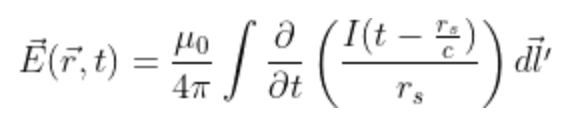

# Electrodynamics Retarded Fields

It takes time for electromagnetic fields to travel from their source.  We can calculate how electromagnetic fields propagate from a current source by using the equations 

